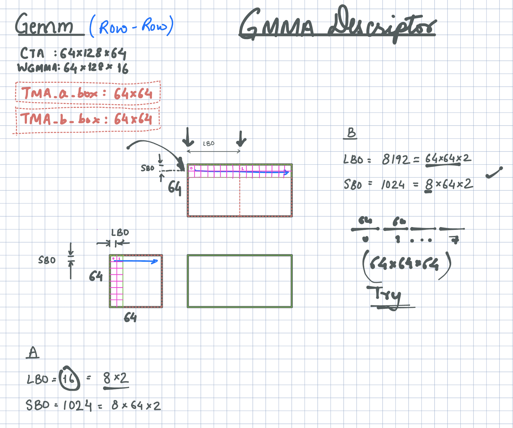
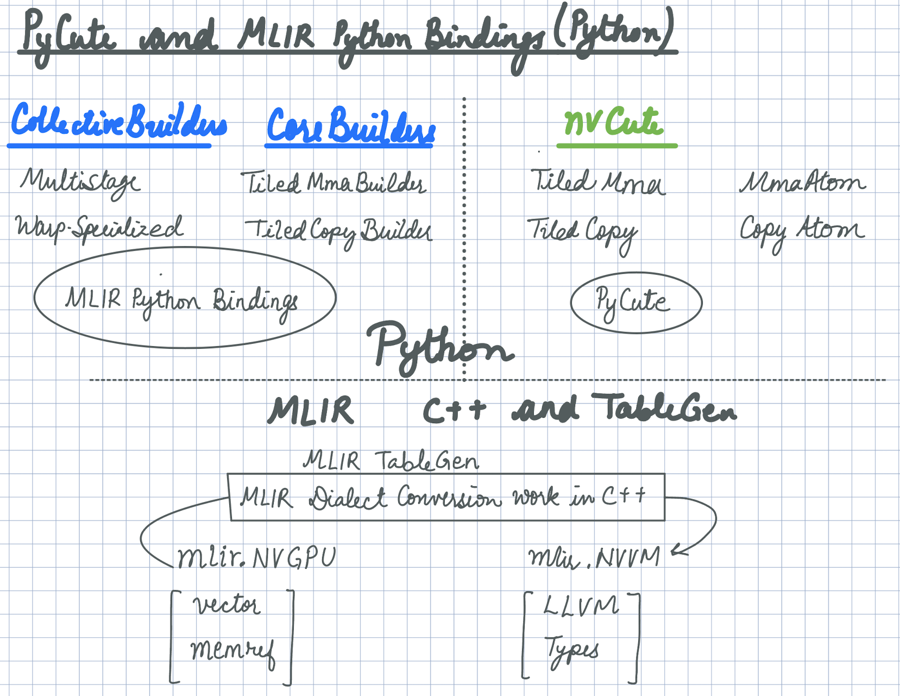
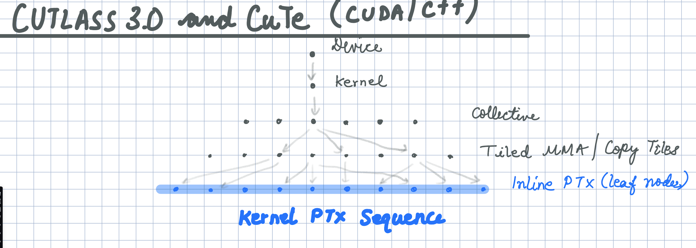

# PyCute and MLIR Python bindings targeting NVIDIA H100

## Summary

This work demonstrates the use of [PyCuTe](https://github.com/manishucsd/cutlass/tree/main/python/pycute) to generate constants and integers for an MLIR Python binding-driven code generation solution targeting `mlir.nvgpu` and `mlir.nvvm`. PyCuTe is employed to tile, partition, compute descriptor bits, and encode layouts, offsets, and strides essential for code generation. This enhances the coverage, scalability, and composability of NVIDIA codegen solutions. By combining CuTe concepts ([layout](https://github.com/manishucsd/cutlass/blob/main/media/docs/cute/01_layout.md) and [layout algebra](https://github.com/manishucsd/cutlass/blob/main/media/docs/cute/02_layout_algebra.md)) with MLIR, all through Python, it brings significant advancements in programmability and user-experience.

## Hopper codegen with PyCuTe

AI accelerators like the NVIDIA H100 hierarchically tile large problems through various memory hierarchy to the compute cores (Tensor Cores). This hierarchical approach leads to blocked layouts where different layout modes emerge at various stages, from global memory to shared memory to registers and closer to the Tensor Cores. The logical significance of these modes often gets obscured due to error-prone div-mod math.

CuTe simplifies this by providing `Layout` and `Layout Algebra`, enabling the definition and manipulation of hierarchical, multidimensional layouts. This approach elegantly scales solutions by abstracting away complex div-mod math, allowing programmers to retain and exploit the logical significance of these modes.

## Example use of PyCuTe Layout to determine WGMMA descriptor

  
  <figcaption align="center">Figure 1. Tiling core matrix (8x8xf16 in pink) on wgmma.m64n128k16 Hopper Tensor Core operations to compute descriptor bits.</figcaption>

This section highlights the power of CuTe concepts. PyCuTe provides MLIR Python codegen with significant enhancements. The smallest unit of math tile exposed to programmers on Hopper is `wgmma.m64nNk16`. However, for effective codegen, tiling needs to be addressed beyond that point. The core matrix `8x8xf16` (highlighted in pink) must be tiled over `wgmma.m64nNk16` to obtain the GMMA descriptor bits.

Figure 1 shows the definitions of `wgmma` descriptors: Leading Byte Offset (LBO) and Stride Byte Offset (SBO), which are crucial in setting the GMMA descriptor bits. The figure illustrates a `64x128x64` CTA tile and a `64x128x16` `wgmma` Tensor Core, where shared memory tiles are loaded using TMA. LBO represents the byte offset between two core matrices in the contiguous dimension (blue line), while SBO is the byte offset between core matrices in the strided dimension.

Using these definitions, we can apply architecture-specific tiling operations to deduce compile-time integer values for various data types and layouts. Please refer to the PyCuTe code implemented in this work to understand how the figure converts into integers.

**CuTe's layout algebra enables us to transform illustrations into code, code into integers, and integers into codegen, improving scalability, correctness, and user-experience. While it can also enhance code readability, this requires thorough familiarity with the CuTe documentation and practice.**

## Structuring codegen with PyCuTe and MLIR Python bindings

The example above demonstrates how PyCuTe aids in tiling part of a large problem hierarchically to utilize Hopper Tensor Cores. PyCuTe concepts prove valuable in many scenarios. I champion that the software components need to be carefully to target the Hopper and exploit its power to combine different arch features. The CUTLASS/CuTe (CUDA/C++) solution has established a reliable approach to decomposing problems for Hopper Tensor Cores while maximizing performance and scalability. Next, we present code structures built using MLIR Python bindings and PyCuTe (Python), incorporating insights gained from the CUTLASS/CuTe solution in CUDA/C++.

  
  <figcaption align="center">Figure 2. Code components building a Hopper codegen solution "almost" all in Python.</figcaption>

## Code structure

- **pycute** is used from [third-party/cutlass/python/pycute](https://github.com/manishucsd/cutlass/tree/033d9efd2db0bbbcf3b3b0650acde6c472f3948e/python/pycute) to handle Layout and  Layout algebra e.g. `layout_composition`, `logical_divide`, `zipped_divide`, `layout_product` etc. **Note that the four Python files in the cutlass/python/pycute folder is all that his project depends on from the NVIDIA/CUTLASS repo. Isn't it amazing that these four files are so powerful that it can handle multiple generation of NVIDIA architectures and more!**

- **nvcute** built in this repo on top of `pycute` to handle NVIDIA architecture-specific details soley in Python. This part doesn't use any MLIR (Python bindings or C++).
  
  - [MmaAtom](https://github.com/manishucsd/py-codegen/blob/f63ac844dc53de68ba8fe6ebd323dfc769fc24b1/nvcute/tiled_mma.py#L74) encodes the details of `wgmma` Tensor Core instructions such as instruction shape, operand, and accumulator layout.
  - [TiledMma](https://github.com/manishucsd/py-codegen/blob/f63ac844dc53de68ba8fe6ebd323dfc769fc24b1/nvcute/tiled_mma.py#L118) Tiles `MmaAtom` on a CTA tile.
    - Computes the number `MmaAtom`[s] required to fill the CTA tile m-, n-, and k-dimensions.
    - Creates desc for A and B operands in shared memory.
    - Finds the increments in bytes along m-, n-, and k- dimensions as the `MmaAtom` are tiled on a CTA.
  - `TiledCopy` computes the meta information required to tile TMA copy operations to fill the entire tile.
    - Shared memory swizzle.
    - Number of boxes required to fill the CTA when using TMA copy.
    - Shared memory layout after the `TiledCopy` operations.

- **codegen** is where we use the meta information from nvcute components and use it to generate/build kernels using MLIR Python bindings. Note that any component or file with `builder` as a suffix is an MLIR builder emitting MLIR operations. Please see [TiledMmaBuilder](https://github.com/manishucsd/py-codegen/blob/f63ac844dc53de68ba8fe6ebd323dfc769fc24b1/codegen/core/tiled_mma_builder.py) and [TiledCopyBuilder](https://github.com/manishucsd/py-codegen/blob/f63ac844dc53de68ba8fe6ebd323dfc769fc24b1/codegen/core/tiled_copy_builder.py).

## Related work and what about performance?

There is existing work showcasing MLIR Python bindings targeting `mlir.nvgpu` and `mlir.nvvm` can achieve decent performance on selected cases (a) JAX mosaic GPU work (see commits [1](https://github.com/google/jax/pull/20775), [2](https://github.com/google/jax/pull/20935/files)) and (b) LLVM/MLIR work on [NVDSL](https://github.com/llvm/llvm-project/pull/87065). This work adds value by using PyCute to scale several more senario by making the codegen more general. Additionally, apply the software design philosophy similar to CUDA/C++ (CUTLASS/CuTe) in Pythonic codegen (MLIR Python bindings/PyCute).

I set out to do this work prove to myself that we can tame the PTX on Hopper architecture and get close to the CUTLASS's PTX using PyCuTe and MLIR Python bindings. If we can get close CUTLASS's PTX in a way we understand it (as much as we can), we should see similar performance. Refering to Figure 3., I see CUTLASS as codegenerator where C++ compiler triggers a tree of C++ templates to reach leaf nodes of inline PTX stiched together to form a kernel.

  
  <figcaption align="center">Figure 3. Code components building a Hopper codegen solution "almost" all in Python.</figcaption>

From my experience, I am now 98% certain that this is doable and the remaining 2% is software engineering and a desing problem, but remember ["the last 2% are the hardest part and that's why they leave it in the milk."](https://youtu.be/xk_Drdc1_jM?si=qQ19FgC_JKtTkuoW) I am joking here it probably more than 2%, but it is doable. 

### Trade-offs
A MLIR Python-based codegenerator will have some trade-offs which we discuss next. The pros section list the advantanges of using PyCute which are also discussed above.

#### Pros
- Composability : E.g. TMA + WGMMA or LDGSTS + WGMMA, or TMA + MMA.SYNC. We create `Tiled[Mma|Copy]Builder` for each of these components where we change the underlying `MmaAtom` or `CopyAtom` to change emitted PTX.
- PyCute enhances scalability.
- Developer productivity in getting a kernel out the door, while still having full PTX level control through Python.
- Provided the `Tiled*Builder` components are present and developed by a CUDA expert, the user of these components can compose different kernels.
- PyCute allows us to decoupling address offset computations from the kernel logic and putting it in a reusable components.

#### Cons
- Slower than a fully-optimized codegen in C++. However, this should be faster than using nvcc on CUDA/C++ templates.
- This will have a dependence on Python and cannot be shipped as a binary solution.
- To use the full power of CuTe in Python and support layout algebra on runtime values, we need a "`PyCuTeBuilder`" that to emit `mlir.arith` operations on runtime values.
This approach is more performant as a ahead-of-time compilation strategy. If Python is in the critical path it will slow down just-in-time compilation.
- CUTLASS/CuTe C++ is more powerful than what we intent to build out here as the C++ versions support GETT and contractions on multi-dimensional tensors.

### Acknowledgements
"If we have seen further it is by standing on the shoulders of Giants." I express my gratitude to those whose groundbreaking work has paved the way for this study. My thanks go to the colleagues with whom I've had technical interactions and shared experience of working together. Pradeep Ramani, Haicheng Wu, Andrew Kerr, Vijay Thakker, and Cris Cecka working on CUTLASS/CuTe. Guray Ozen and Thomas Raoux on NVGPU and NVVM. Adam Paszke on JAX Moasic GPU. Quentin Colombet, Jacques Pienaar, Aart Bik, Alex Zinenko, and Mehdi Amini on MLIR.
